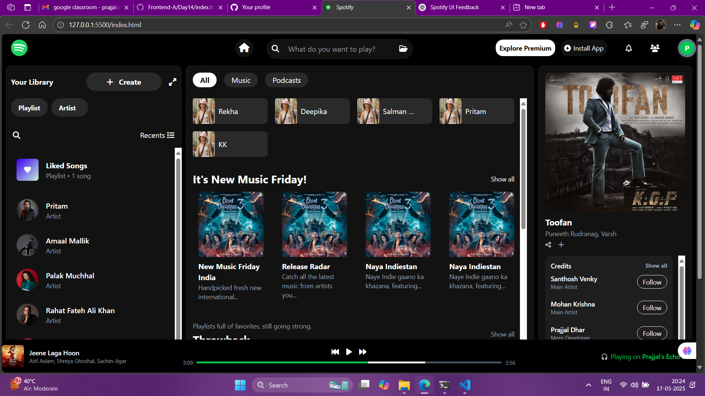

# 🎧 Spotify Clone UI - Tailwind CSS

This is a **responsive frontend UI clone** of the Spotify web app built using **HTML** and **Tailwind CSS**.  
The layout is completely mobile-friendly, featuring a modern navigation bar, responsive sidebar, and artist/card grid similar to Spotify's UI.

---

## 🚀 Features

- 🔍 Responsive top search bar with icons
- 📚 Sidebar with scrollable artist list
- 🎵 Main content area with filters and grid cards
- 📱 Fully responsive for mobile, tablet, and desktop views
- 🌗 Built with clean Tailwind CSS utility classes

---

## 🖼️ UI Preview

## 🛠️ Tech Stack

- **HTML5**
- **Tailwind CSS v3**
- **Font Awesome** for icons

---

## 👨‍💻 Created By

**Prajjal Dhar**  
💼 Senior Mern Stack Developer
✉️ _Connect via [LinkedIn](https://www.linkedin.com/in/prajjaldhar/)_ (add your link)

---
